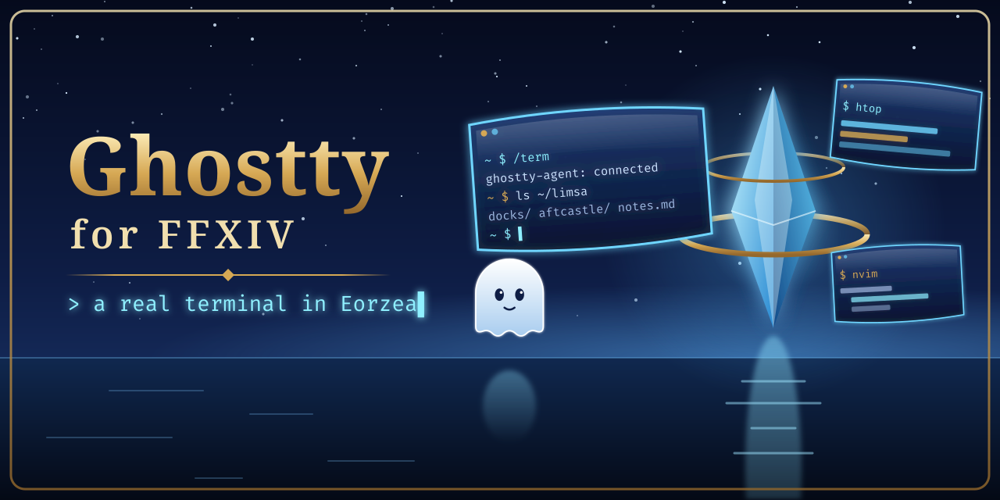

# Ghostty for Dalamud



**Vote on what it does next: https://spacegho.st/mods/ffxiv/term/vote/**

In game, Settings → About has a button that opens the vote page in your
browser, and a small dot on the settings button shows while there are ideas
you have not looked at. The plugin never goes online for this: the idea count
ships with each build. This is new and not yet verified in game.

A [Ghostty](https://ghostty.org) terminal living inside Final Fantasy XIV, as
a Dalamud plugin, so the game can double as a desktop. Press
<kbd>ctrl</kbd>+<kbd>`</kbd> for a Quake-style drop-down with tabs, click the
server info bar entry, or, with [Umbra](https://github.com/una-xiv/umbra)
installed, use its toolbar widget for a popup terminal.

The terminal core is [libghostty-vt](https://mitchellh.com/writing/libghostty-is-coming),
the exact VT engine Ghostty ships, so escape sequences, scrollback, colours,
kitty keyboard protocol and friends behave like the real thing. Rendering is
done straight into Dalamud's ImGui draw lists.

Languages, by design: **Nelua** for the core (`core/`, `agent/`) and **Lua**
for policy and configuration (`lua/`). The only C# is two logic-free shims
Dalamud and Umbra need in order to load anything at all (`shim/`), and the
only C is vendored (libghostty-vt is Zig; Lua 5.4; the cimgui header).

## Screenshots

<!-- screenshots: dropdown, popup, world panels, bell (take them with /term showcase) -->

None yet. `/term showcase` sets up demo terminals and camera shots for taking
them with your own terminals hidden.

## What you get

| Piece | Where it runs | Purpose |
|---|---|---|
| `GhosttyDalamud.dll` | inside the game (.NET) | Dalamud plugin shim: loads the core, forwards the frame tick, UI buttons and game facilities |
| `ghostty_loader.dll` | inside the game (native, Nelua) | runs a copy of `ghostty_core.dll` and swaps it within ~2 s when the file changes (`/term reload-core`) |
| `ghostty_core.dll` | inside the game (native, Nelua) | libghostty-vt terminal, ImGui renderer, input encoding, transports, embedded Lua VM; registers `/term`, the info bar entry and IPC |
| `lua/*.lua` | inside the game (Lua) | profiles, keys, layout, transport choice, what gets registered |
| `Umbra.Ghostty.dll` | inside Umbra (.NET, optional) | toolbar widget + popup, calling the plugin over IPC |
| `ghostty-agent` / `ghostty-agent.exe` | on your Linux/macOS box, or on Windows beside the game (Nelua) | PTY server: shells, ssh, tmux, anything, as persistent sessions |

### Transports

* **agent** – the plugin connects over TCP to `ghostty-agent` running on the
  host (or anywhere reachable). Keep it on loopback, or reach it through
  `ssh -L` or a private network: connections must present the token, but the
  stream is not encrypted. Sessions survive the plugin reloading or the game
  closing; reattaching replays the recent raw output and libghostty rebuilds
  the screen, which is the same model Superlogical uses. This is the transport
  to use when the game runs under Wine/Proton on Linux, and on native Windows
  with `ghostty-agent.exe` (see [Windows](#windows)).
* **conpty** – a Windows pseudo console inside the game process (PowerShell,
  cmd, `ssh.exe`, …). Needs no agent, but its shells end when the game
  closes. On native Windows the default profiles fall back to it while no
  agent answers. Under Wine it is untested in game.
* **ssh** – not a transport of its own: run `ssh host` through either of the
  above (see the commented examples in `lua/init.lua`).
* **superlogical** – placeholder. Mitchell Hashimoto's
  [Superlogical](https://mitchellh.com/writing/superlogical) multiplexer is
  in private beta and has not published a client protocol yet; once it does,
  it slots in as another transport (it streams raw PTY bytes to libghostty
  clients, exactly like `ghostty-agent`).

## Requirements

* **Build host:** Linux (glibc or musl) with `git`, a C compiler, `make`,
  `python3`, `curl`, [Zig 0.16.0](https://ziglang.org/download/) and the
  [.NET 10 SDK](https://dotnet.microsoft.com/). Nelua is built from the pinned
  fork automatically.
* **Game:** FFXIV with Dalamud (XIVLauncher on Windows, or XIVLauncher.Core
  under Wine/Proton on Linux) and dev plugins enabled. The manifest targets
  Dalamud API level 15.
* **Agent host:** Linux or macOS (`ghostty-agent`), or Windows 10 1809 or
  later (`ghostty-agent.exe`, ConPTY). The `conpty` transport needs the game
  on Windows.
* **Umbra** is optional.

## Building

```sh
tools/fetch-vendor.sh      # clones ghostty, nelua, gc-cimgui, umbra-dist; downloads lua + Dalamud dev assemblies
tools/build.sh             # everything into build/dist/
tests/run.sh               # host-side tests (libghostty binding, renderer, Lua policy, agent end-to-end)
```

`tools/build.sh` reads these overrides:

| Variable | Default | What |
|---|---|---|
| `ZIG`, `DOTNET` | `zig`, `dotnet` on `PATH` | the binaries, e.g. `ZIG=/path/to/zig DOTNET=/path/to/dotnet` |
| `DALAMUD_LIB_PATH` | `~/.cache/dalamud-dev` (filled by `fetch-vendor.sh` from goatcorp's dalamud-distrib) | Dalamud reference assemblies; your launcher's `dalamud/Hooks/dev` directory works too |
| `UMBRA_LIB_PATH` | `vendor/umbra-dist/dist` | Umbra reference assemblies, or an installed Umbra version directory |
| `SKIP_SHIM=1`, `SKIP_UMBRA=1`, `SKIP_WIN=1` | | skip the C# projects, only the widget, or the Windows core |
| `SKIP_DEPS=1` | | reuse the Nelua, libghostty-vt and Lua builds already in `build/` |

The .NET SDK does not need root: `dotnet-install.sh --channel 10.0 --install-dir <dir>`
(with a disk-backed `TMPDIR` if `/tmp` is small).

`tools/ci/run.sh test build` does the same with pinned, checksum-verified Zig
and Dalamud assemblies; it is what GitHub Actions and the self-hosted runners
run (see [docs/CI.md](docs/CI.md)).

Output:

| Path | What |
|---|---|
| `build/dist/GhosttyDalamud/` | the loadable plugin folder: `GhosttyDalamud.dll`, `GhosttyDalamud.json`, `ghostty_loader.dll`, `ghostty_core.dll`, `lua/` |
| `build/dist/Umbra.Ghostty.dll` | the optional Umbra widget |
| `build/dist/ghostty-agent` | the PTY server for the build host |
| `build/dist/ghostty-agent.exe` | the PTY server for Windows |

`tools/package.sh` (after `tools/build.sh`) packs what a Windows player
installs, all in `build/dist/` and named after `AssemblyVersion` in
`shim/GhosttyDalamud/GhosttyDalamud.json`; it publishes nothing:

| Path | What |
|---|---|
| `GhosttyDalamud-<version>.zip` | the plugin folder as Dalamud installs it from a custom repository |
| `ghostty-agent-<version>-windows-x64.zip` | `ghostty-agent.exe` |
| `pluginmaster.json` | a Dalamud custom-repository listing pointing at the plugin zip |

It reads `DOWNLOAD_BASE_URL` (where the zip will be downloadable, without the
file name; with `GITHUB_REPOSITORY` set it defaults to that repository's
release `v<version>`, otherwise a placeholder and a warning), `REPO_URL` and
`SOURCE_DATE_EPOCH` (entry times, default the last commit's, so the same build
packs to the same bytes). All build, package and test scripts are
non-interactive, configured by environment variables, and exit non-zero on
failure.

Dalamud, Umbra and game assemblies are referenced but never shipped; the build
fails if one lands in the output.

## Installing

1. **Start the agent** on your Linux/macOS machine. It writes a token to
   `~/.config/ghostty-agent/token` on first run:

   ```sh
   build/dist/ghostty-agent --listen 127.0.0.1:7777
   ```

   Other options: `--token-file PATH`, `--clipboard-file PATH`,
   `--replay-bytes N`, `--term NAME`. If the game runs on another machine,
   forward the port (`ssh -L 7777:127.0.0.1:7777 …`) and copy the token file
   over. Running the agent as a user service keeps your sessions alive between
   game sessions.

2. **Stage the plugin** as a dev plugin:

   ```sh
   tools/install-dev.sh            # into $GHOSTTY_DEV_PLUGIN_DIR, default build/dev-plugin/GhosttyDalamud
   tools/install-dev.sh --widget   # also $UMBRA_WIDGET_DLL, default build/dev-plugin/Umbra.Ghostty/Umbra.Ghostty.dll
   ```

   Every file is written beside its target and renamed into place, so a
   running Dalamud hot-reloads cleanly. The script prints the Wine `Z:\…` path
   of the staged DLL. On Windows, copy `build/dist/GhosttyDalamud/` anywhere
   yourself.

3. **In game:** `/xlsettings` → Experimental → Dev Plugin Locations, add the
   path the script printed and save; then `/xlplugins` → Dev Tools → enable
   **Ghostty** and tick load on boot. If Dalamud says the location does not
   exist and your home directory is reached through a symlink, try the path
   with the symlink resolved (`readlink -f`), or the other way round.

## Windows

Everything here is built on Linux and **has not been run on a real Windows
machine yet**. What was observed: `ghostty-agent.exe` under Wine (Proton 11)
served a `cmd.exe` session end to end (see Limitations). The plugin itself,
its Windows defaults, the fallback to local shells and the packages below
have not been seen working in game on Windows.

Nothing a Windows player needs involves bash, Wine or a Linux machine.

### Install the plugin

Either way needs Dalamud (XIVLauncher on Windows).

* **From a custom repository** (once someone hosts the files that
  `tools/package.sh` makes): `/xlsettings` → Experimental → Custom Plugin
  Repositories, add the URL of the hosted `pluginmaster.json`, save; then
  `/xlplugins` → All Plugins → install **Ghostty**. The listing's download
  links must point at the hosted `GhosttyDalamud-<version>.zip`.
* **As a dev plugin:** unzip `GhosttyDalamud-<version>.zip` (or copy
  `build/dist/GhosttyDalamud/`) to a folder of your own, e.g.
  `%APPDATA%\GhosttyDalamud\dev\GhosttyDalamud`. `/xlsettings` →
  Experimental → Dev Plugin Locations, add the full path of
  `GhosttyDalamud.dll` in it, save; `/xlplugins` → Dev Tools → enable
  **Ghostty** and tick load on boot. To update, replace the files; a new
  `ghostty_core.dll` is picked up within about two seconds.

### Run the agent

Without an agent the plugin still works: its default profiles open local
PowerShell and cmd terminals (ConPTY) inside the game, which close with the
game. For shells that survive the game closing or crashing:

1. Unzip `ghostty-agent-<version>-windows-x64.zip` somewhere permanent, e.g.
   `%LOCALAPPDATA%\ghostty-agent\ghostty-agent.exe`.
2. Run it. On first start it writes a random token to
   `%APPDATA%\ghostty-agent\token`, readable only by your user, and listens
   on `127.0.0.1:7777`. Options as on Linux: `--listen HOST:PORT`,
   `--token-file PATH`, `--replay-bytes N`, `--term NAME`. It is a console
   program; closing its window ends it and every shell it runs.
3. In game the default profiles (`powershell`, `cmd`) now open through the
   agent: the plugin reads the same token file, so there is nothing to
   configure. A terminal opened while no agent answered stays local.

Start on login, pick one:

* **Startup folder:** `Win+R` → `shell:startup`, create a shortcut to
  `ghostty-agent.exe` there, and in its Properties set Run: Minimized.
* **Task Scheduler:** Create Task → General: "Run only when user is logged
  on" (the agent needs your desktop for the clipboard); Triggers: At log on,
  your user; Actions: Start a program, `ghostty-agent.exe`; Settings: untick
  "Stop the task if it runs longer than".

Neither needs administrator rights; the agent is a normal user process.

### Windows defaults and clipboard

`lua/platform.lua` picks the defaults from `ghostty.platform()`: `'windows'`
on native Windows, `'wine'` for the same DLL under Wine or Proton (ntdll
exports `wine_get_version`). On `'windows'` the agent token file is
`%APPDATA%\ghostty-agent\token` and the profiles are `powershell` and
`cmd` through the agent, each with a `fallback` naming its local ConPTY twin
(`powershell (local)`, `cmd (local)`). Under Wine nothing changed: the Linux
agent's `~/.config/ghostty-agent/token`, bash and tmux through the agent,
pwsh and cmd over ConPTY. A copied `init.lua` that sets `agent` and
`profiles` itself is used as it is.

Copy and paste use the Windows clipboard through Dalamud's ImGui when no
agent is connected; with the Windows agent they also go through the agent's
Win32 clipboard (the same clipboard when the agent runs on the game's
machine). Neither has been tried on Windows.

### Optional: Umbra widget

Umbra → Settings → Plugins → add the path to `Umbra.Ghostty.dll`, then add the
**Ghostty terminal** widget to a toolbar. The widget has no native code: it
talks to the plugin over IPC and shows "ghostty offline" when the plugin is
not loaded. While the widget is active, the server info bar entry hides itself
(`host.dtr.mode = 'auto'`; set it to `'always'` or `'never'`). Umbra reloads
by itself when the DLL changes.

### Upgrading from the Umbra-hosted build

Until the standalone plugin (the releases listed as 0.1 to 0.4 in the
Changelog tab) the terminal core was loaded by the Umbra widget and kept its
files in `pluginConfigs/Umbra/ghostty`. Back up that directory and the old
`Umbra.Ghostty.dll` first if you want a way back; `install-dev.sh` does not.

On its first start the plugin copies, from `pluginConfigs/Umbra/ghostty` (or
`$UMBRA_GHOSTTY_HOME`), whatever is not already in its own config directory:
`settings.lua`, `world-state.lua`, `lua/init.lua` and `lua/keymap.lua` when
they differ from the shipped ones (the agent token lives in `init.lua`), and
your own modules this build does not ship. Changed copies of other shipped
modules go to `legacy-lua/`, which is not loaded. Every copy is made
owner-only (mode 0600; on Windows a DACL naming only you). It then renames the
old `ghostty_umbra.dll` to `ghostty_umbra.dll.migrated` and writes
`migrated-from-umbra.txt`, after which it never runs again. Settings → Plugin
status shows the result.

Rollback: disable Ghostty in Dev Tools, rename `ghostty_umbra.dll.migrated`
back and restore the old `Umbra.Ghostty.dll`.

## Configuration

The config directory is `<Dalamud config>/pluginConfigs/GhosttyDalamud/`:
`%APPDATA%\XIVLauncher\pluginConfigs` on Windows, `~/.xlcore/pluginConfigs`
with XIVLauncher.Core. Set `GHOSTTY_HOME` to use a directory of your own.

* Most options are in the settings window (`/term config`, or Settings in
  `/xlplugins`), saved to `settings.lua` there.
* For the rest, copy `lua/init.lua` (profiles, agent address and token,
  commands, info bar behaviour; the per-platform defaults it starts from are
  in `lua/platform.lua`) or `lua/keymap.lua` (which chords the plugin
  handles; everything else goes to the terminal exactly as Ghostty would
  encode it) into the config directory's `lua/`. That directory comes first on
  `package.path`, so files there win over the shipped ones. Settings made in
  the window apply on top.

A minimal override, `pluginConfigs/GhosttyDalamud/lua/init.lua`, starting from
a copy of the shipped file:

```lua
agent = {
  host = '127.0.0.1',
  port = 7777,
  token = '',
  token_file = home .. '/.config/ghostty-agent/token',
},
profiles = {
  { name = 'shell', transport = 'agent', command = { '/bin/bash', '-l' } },
  { name = 'ssh',   transport = 'agent', command = { 'ssh', '-t', 'example-host' } },
},
```

Reload with `/term reload`.

`lua/bell.lua` shapes the visual bell: when a program rings (BEL), rings of
light spread from your character's feet and the terminal that rang glows.

`CONFIG.world.shadows` in `lua/world.lua` (Settings → Light → "Screens cast
shadows (experimental)", off by default) puts a thin board, a background
object only you see and with no collision, behind each world screen so it
casts a shadow and blocks sunlight. **Experimental and untested in game**: it
calls a game function found by signature, so a game patch can crash the game
while it is on; seen from behind, the board probably hides the screen
with the depth test on.

## Commands and keys

`/term` (also `/tomestone` and `/tome`, see `host.commands`):

| Command | What |
|---|---|
| `/term`, `/term toggle` | show or hide the drop-down |
| `/term new [n]`, `/term window [n]` | a new tab, or a floating window, with profile *n* |
| `/term pin [here\|me\|target\|orbit]` | pin the active tab (or a new terminal) into the world |
| `/term unpin` | the focused world terminal goes back to the drop-down |
| `/term pet` | a terminal that floats beside your character |
| `/term occluded on\|off` | whether the focused world screen keeps running while unseen |
| `/term min [id]`, `/term restore [id]`, `/term focus id` | minimise, restore or raise a terminal |
| `/term send [#id] text`, `/term type [#id] text` | type into a terminal, with or without Enter |
| `/term bell [ripple\|sonar\|burst\|aura\|calm\|custom\|demo]` | preview the visual bell |
| `/term showcase`, `/term showcase off` | demo terminals and camera shots for screenshots; needs nothing on disk |
| `/term config` | the settings window |
| `/term reload` | reload the Lua configuration |

Keys (`lua/init.lua`, `lua/keymap.lua`): <kbd>ctrl</kbd>+<kbd>`</kbd> toggles
the drop-down and <kbd>ctrl</kbd>+<kbd>shift</kbd>+<kbd>`</kbd> the terminals in
the world. Inside a terminal: <kbd>ctrl</kbd>+<kbd>shift</kbd>+<kbd>c</kbd> /
<kbd>v</kbd> copy and paste (a mouse selection is copied on release, see
`copy_on_select`), <kbd>ctrl</kbd>+<kbd>shift</kbd>+<kbd>t</kbd> /
<kbd>w</kbd> open and close tabs, <kbd>ctrl</kbd>+<kbd>tab</kbd> switches tabs,
<kbd>ctrl</kbd>+<kbd>=</kbd> / <kbd>-</kbd> / <kbd>0</kbd> zoom.

Info bar entry (`host.dtr.on_click`): click toggles the drop-down,
right-click opens the popup, shift+click opens a window, ctrl+click shows the
world screens. The popup closes when it loses focus; <kbd>Esc</kbd> goes to
the terminal.

## Controller

`toggle_gamepad_button` (default `select`: the Xbox View button; on a
DualSense, Dalamud reports the touchpad click as `select`). Tap shows or hides
the drop-down; hold steps to the next terminal and repeats while held; double
tap goes to the previous one. Valid names: `dpad_up dpad_down dpad_left
dpad_right north south west east l1 l2 l3 r1 r2 r3 select start create`. An
empty string disables it.

`create` is the Create button of a DualSense or DualSense Edge, which the game
leaves unused. Dalamud's gamepad state has no such button, so the core reads
the controller's HID input reports itself (`core/sys/dualsense_reader.nelua`):
USB report `0x01` and Bluetooth reports `0x31` and `0x01` (simple mode),
vendor `054C`, products `0CE6` and `0DF2`. It opens the controller read-only
and shared, asks for a queue of only 2 reports on its handle, reads it
without waiting (one overlapped read, collected once per frame), and closes
it on unplug, when you pick another button, and when the plugin unloads.
Create only counts while the game's window is in front: the controller's
reports arrive whichever window has focus, and elsewhere Create is the
capture button of Steam, Game Bar and Remote Play. The default stays
`select`, so nothing changes without a DualSense. To switch, pick `create`
under Settings → Keys & controller, or set it in your `lua/init.lua` copy:

```lua
toggle_gamepad_button = 'create',
```

Finding the controller is not free: listing and opening HID devices are
synchronous calls on the render thread (under Wine each is a round trip
through wineserver), and closing waits up to 1 s for the cancelled read.
While no controller is open, a search looks at a few HID devices per frame
and opens only those whose device path does not name another vendor or
product. After a search that found nothing the next one waits 3 s, then 6,
12, 24 and at most 30 s, so a controller that is off, unplugged, hidden (for
example by HidHide) or not exposed through hidraw costs one search every
30 s. A controller that fails to open with the same error twice (another
program holds it) is retried every 30 s. A device arrival notification
(`CM_Register_Notification`) starts a search within about a second and
resets the wait; without one, a controller connected later can take up to
30 s to be found.

The log shows `DualSense 054c:0ce6 opened for the Create button` and, with the
first report, which layout it sends. **This HID path has only been tested on
the host with fake devices; it has not been observed in game, on Windows or
under Wine.** Under Wine it relies on winebus exposing the controller through
its hidraw backend, which needs read access to the controller's
`/dev/hidraw*` node. Not measured or observed: whether a search still costs a
visible hitch, whether Wine delivers device arrival notifications, and how
late Create arrives under Wine. Wine hands device reads to winedevice, so an
overlapped read probably never completes at once: about one report is
collected per frame while the controller sends about 250 a second. With the
default queue of 32 reports every read would be about 130 ms old; the 2-report
queue should keep it within a frame or two. That is inferred from how Wine
handles overlapped reads, not observed.

## Privacy

Everything runs on your machines. From the code: the plugin connects only to
the agent address you configure, sends no telemetry, and logs only to
Dalamud's local log. The agent listens only on the address you pass (default
`127.0.0.1:7777`) and requires the token (on Windows kept in
`%APPDATA%\ghostty-agent\token` with an owner-only DACL); the stream is not encrypted, so
tunnel it for remote use. Migrated config copies are written owner-only.
`/term showcase` hides your own terminals while it runs.

At build time only, `tools/fetch-vendor.sh` downloads the pinned sources
(GitHub, lua.org, goatcorp's dalamud-distrib), and `tools/build.sh` sets
`DOTNET_CLI_TELEMETRY_OPTOUT=1`.

## Limitations and unverified behaviour

Tested on the host (`tests/run.sh`): the libghostty-vt binding, cell renderer,
key encoding, DualSense report parsing, Lua policy, agent protocol and server,
the plugin's activation state machine, its command / info bar / IPC registration and the config
migration (`tests/test_hostsurface.nelua`, `tests/test_migrate.*`), the
per-platform defaults and local fallbacks (`tests/test_platform.*`) and the
agent's shared pure logic (`tests/test_agent_logic.nelua`). Both C#
projects, the Windows DLLs and `ghostty-agent.exe` compile.

**The standalone plugin, its info bar entry and the IPC-only Umbra widget have
not been observed in game.** What they assume:

| Assumption | Symptom if wrong |
|---|---|
| `Pi.AssemblyLocation` names the dev folder, so `ghostty_core.dll` and `lua/` are found beside it | `NativeLibrary.Load` throws in `Plugin()`; check the path in the Dalamud error |
| The hand-written `GhosttyDalamud.json` (API level 15) is enough for a dev plugin | Dalamud refuses the manifest; compare with a DalamudPackager-generated one |
| `Pi.ConfigDirectory` exists after first access and its parent is `pluginConfigs` | the migration finds no legacy home; `GHOSTTY_HOME` overrides the config dir |
| `GetModuleHandleA("ghostty_umbra.dll")` and the `Local\ghostty-core-<pid>` mutex behave under Wine as on Windows | `core/sys/procguard.nelua`; a leaked mutex blocks reloads until the game restarts |
| Renaming a mapped `ghostty_umbra.dll` under Wine works | the migration logs `could not rename`; it only runs after the old core is gone, so it should not be mapped |
| IPC of `(int, int)` and `nint` between plugins needs no conversion | the widget stays "ghostty offline" while the plugin runs; the log shows an IPC type error |
| Pushing Dalamud's mono font from inside Umbra's popup draw is fine | popup text in the wrong font or an ImGui assert |
| Registering commands, the info bar entry and IPC from `UiBuilder.Draw` is allowed | a Dalamud thread-safety exception in the log |
| `IDtrBarEntry.OnClick` positions are screen coordinates | the info bar popup opens away from the entry |
| The UI-hide defaults (`host.keep_visible`) match what Umbra did | change them in Settings → Info bar & hidden UI |
| Panel lights survive a logout and login (world panels, pets, animation and world pins wait for a character) | lights missing or stale after logging back in |
| Panel shadows (experimental, off by default): `BgObject.Create`'s signature still matches, `fun_b0_m0766.mdl` is 4 x 3 yalms with its origin at the bottom centre, creating and freeing background objects from the draw callback is safe, and the game does not free them itself on a zone change | a crash with the option on, boards in the wrong place or size (`CONFIG.world.shadows.model_*`), or no shadow |
| Toolbar placement survives the widget becoming IPC-only (same file, assembly name and widget id) | re-add the Ghostty widget in Umbra |
| Per-frame IPC (status and popup draw every frame, exceptions while offline) is cheap enough | frame time rises with the widget; a cheaper status channel is needed |
| The info bar popup has no Esc-to-close, so Esc reaches the terminal | see `popup.close_on_blur` |

**Windows (native):** nothing has been run on real Windows. Observed only
under Wine on Linux, with `tests/smoke_agent_windows.nelua` against
`ghostty-agent.exe` in a throwaway prefix:

| Check | Proton 11 (Wine 11) | Wine XIV staging 10.8 |
|---|---|---|
| token handshake, OPEN `cmd.exe` | yes | yes |
| typed `echo hi` comes back, env override, `PWD` as working directory | yes | no: this Wine gives a pseudo console's child no console handles when they are passed as null (newer Wine and Windows do), so `cmd.exe` exits at once |
| ATTACH replay from a second connection, session kept after the client disconnects, LIST | yes | no (the session had exited) |
| exit status, a command that cannot start refused | yes | refused: yes |
| Win32 clipboard round trip | no: headless, `OpenClipboard` never returned; the agent gave up after 1 s and answered "clipboard unavailable" | yes |
| resize | not checked (Wine has no `mode con`) | not checked |

Not observed anywhere: the agent on Windows itself (console window, start on
login, Windows Defender or SmartScreen reactions to an unsigned exe), the
plugin's Windows defaults and local fallbacks in game, clipboard on Windows,
the custom-repository install and the dev-plugin path on Windows.

Also: the DualSense Create button (`toggle_gamepad_button = 'create'`) is
tested only against fake HID devices, not with a controller, on Windows or
under Wine (see Controller); the `conpty` transport under Wine is untested;
the Superlogical transport is a placeholder until its protocol is public; the
agent stream is not encrypted.

## Troubleshooting

Everything the core logs goes to Dalamud's log (`/xllog`, or `dalamud.log` in
the launcher's directory) prefixed with `[Ghostty]`. A good start should look
like this (expected from the code, not yet seen in game):

```
[Ghostty] ghostty core starting: install=...\GhosttyDalamud config=...\pluginConfigs\GhosttyDalamud
[Ghostty] migrated from ...\Umbra/ghostty: ...     (first start after upgrading only)
[Ghostty] config loaded: 4 profiles, toggle key "grave"
[Ghostty] command /term registered                 (and /tomestone, /tome)
[Ghostty] ghostty core active
[Ghostty] cimgui bound
```

* `waiting: the Umbra-hosted core (ghostty_umbra.dll) is loaded` – an old
  `Umbra.Ghostty.dll` still loaded the old core. The plugin retries every 2 s
  and activates once it is gone: install the widget-only build and restart
  Umbra.
* `waiting: another ghostty core is active in this game process` – another
  copy of the core holds the per-process mutex, or a previous one leaked it;
  restart the game.
* `suspended:` – the old core appeared while the plugin was active. The
  plugin stops drawing and keeps its sessions until the old core unloads.

## Extras: crash-dialog helper (Linux/Wine only)

Linux with XIVLauncher.Core as a flatpak only; not needed, and not usable, on
Windows. `tools/crash-restart.nelua`
builds `crash-restart.exe`, which finds the "Dalamud Crash Handler" dialog and
chooses "Restart normally" then "Restart". `tools/build.sh` does not build it:

```sh
ZIG=zig vendor/nelua-lang/nelua --cc "$PWD/tools/zig-cc-win.sh" \
  -P nogc --cache-dir build/win/cache-crash -o build/dist/crash-restart.exe tools/crash-restart.nelua
tools/crash-restart.sh --once   # run it now inside the running XIVLauncher flatpak
tools/crash-restart.sh          # watch ~/.xlcore/logs for new dalamud_appcrash_*.log
```

Exit codes: 0 clicked, 2 no dialog within `--timeout`, 3 a dialog without the
expected controls; `--dry-run` only reports. The script runs the exe inside
the flatpak so it shares the game's wineserver, and picks the newest Wine
build under `~/.xlcore/compatibilitytool/wine`. Environment overrides:
`XL_APP`, `XLCORE`, `WINE_BIN`, `CRASH_EXE`, `DIALOG_TIMEOUT`, `POLL_SECONDS`.
Only the no-dialog path (exit 2) has been tested; clicking a real crash dialog
has not.

## Credits

Made by Johnneylee Jack Rollins ([github.com/Spaceghost](https://github.com/Spaceghost)).

Built on [Ghostty](https://github.com/ghostty-org/ghostty) and libghostty-vt
(Mitchell Hashimoto and contributors), [Nelua](https://nelua.io),
[Lua 5.4](https://www.lua.org), [Zig](https://ziglang.org),
[Dalamud](https://github.com/goatcorp/Dalamud) and
[gc-cimgui](https://github.com/goatcorp/gc-cimgui) / Dear ImGui (goatcorp),
and [Umbra](https://github.com/una-xiv/umbra) /
[umbra-dist](https://github.com/una-xiv/umbra-dist) (una-xiv).

No license has been chosen yet.

See [`docs/ARCHITECTURE.md`](docs/ARCHITECTURE.md) for how the pieces fit.
