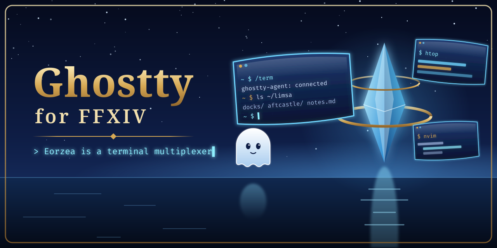
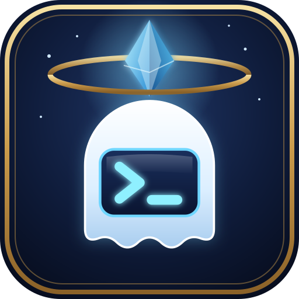

# Ghostty for Dalamud

<p align="center">
  <picture>
    <source media="(prefers-color-scheme: dark)" srcset="images/readme/hero-dark.png">
    <source media="(prefers-color-scheme: light)" srcset="images/readme/hero-light.png">
    
  </picture>
</p>



**Vote on what it does next: https://spacegho.st/mods/ffxiv/term/vote/**

**Experimental developer preview.** This is an independent project, not an
official Ghostty project. Acceptance into the official Dalamud plugin list has
not been established. Host-side tests do not establish Windows, Wine, macOS,
controller, or in-game compatibility. See [release readiness](docs/RELEASE_READINESS.md).

A [Ghostty](https://ghostty.org) terminal living inside Final Fantasy XIV, as
a Dalamud plugin, so the game can double as a desktop. Press
<kbd>ctrl</kbd>+<kbd>`</kbd> for a Quake-style drop-down with tabs, click the
server info bar entry for a list of every terminal (right-click: a popup
terminal), or, with [Umbra](https://github.com/una-xiv/umbra)
installed, use its toolbar widget for a popup terminal.

[Vote on features](https://spacegho.st/mods/ffxiv/term/vote/). The in-game About
screen links to the same page. Its idea catalogue ships with the plugin; the
plugin does not fetch the catalogue in the background.

## Design

The terminal uses [libghostty-vt](https://github.com/ghostty-org/ghostty) for VT
state and renders into Dalamud's ImGui draw lists. The repository contains a
Quake-style drop-down, floating windows, world panels, selection and keyboard
handling, controller input, and configurable appearance. Some game-facing
features remain experimental and unverified on their target environment.

| Component | Purpose |
| --- | --- |
| `GhosttyDalamud.dll` | Dalamud plugin adapter and game facilities |
| `ghostty_loader.dll` | Native core loading and development hot reload |
| `ghostty_core.dll` | Terminal, rendering, transports and embedded Lua |
| `lua/` | Configuration, settings UI, layout and behavior |
| `Umbra.Ghostty.dll` | Optional toolbar widget using versioned plugin IPC |
| `ghostty-agent` | Separate POSIX process hosting terminal sessions |

**Gallery: https://spacegho.st/mods/ffxiv/term/gallery/**, screenshots shared by
players.

Sharing one takes one click. With a terminal on screen (the dropdown, a
window or a screen in the world), take a normal screenshot with the game's
screenshot key. The plugin sees the new file in the game's screenshot folder
and a small prompt in the bottom right asks **Share to the Ghostty gallery?**
Click **Share**. The image goes to the gallery, where the site owner reviews it
before anyone else can see it. Tick **Credit it to Name@World** in the prompt to
have your character named under it; left unticked, it is anonymous.

The gallery takes uploads from signed-in accounts only. The first **Share**
shows **Link Ghostty to your account: code XXXX-XXXX** and opens the link page
in your browser; sign in there (GitHub or XIVAuth) and approve Ghostty, and the
screenshot goes up by itself. The link lasts 180 days, is kept in
`settings.lua` in the plugin's config folder and is never logged;
`/term share unlink` forgets it, and the site's connected apps page revokes it.
Not yet tried in game.

- `/term share`, the camera button in the dropdown's tab bar, or Settings →
  About → **Share my latest screenshot** offer your most recent screenshot at
  any time.
- **Don't ask again** in the prompt, `/term share off` or Settings → Gallery
  turns the prompt off; `/term share on` turns it back on.
- Nothing is uploaded without the click. The prompt only watches the folder
  while a terminal is on screen, or was within the last minute, and a
  screenshot taken while no terminal was showing is never offered.
- The gallery takes PNG and JPEG up to 8 MB. A 4K PNG can be larger: the
  prompt says so, and JPG (System Configuration → Other Settings →
  Screenshots) is much smaller. The site strips the files' embedded metadata.
- The folder is the game's own screenshot setting (`ScreenShotDir`), else
  `screenshots` in the game's user folder; `CONFIG.gallery.folders` in
  `lua/gallery.lua` adds more (for example a Steam or ShareX folder).
- You can also pick a file on the gallery page itself.

`/term showcase` sets up demo terminals and camera shots for taking them with
your own terminals hidden.

### Shots the terminals are certainly in

The game's screenshot key writes the frame the game composed; the terminals are
drawn on top of it by Dalamud, and whether they land in that file has never
been checked here. `/term shot` removes the question by taking the picture
after every ImGui window has been drawn into the frame: it copies the finished
frame — the world, the game's UI and every ImGui window on top of it — and
writes a PNG into the plugin's own `screenshots` folder, then offers it to the
same share prompt.

| Command | What it does |
|---|---|
| `/term shot` | the whole frame |
| `/term shot panel` | just the terminal window in focus |
| `/term shot clean` | hides the game's own UI (action bars, party list, chat log…) for the shot and puts it back |
| `/term clip [seconds] [gif\|mp4]` | records a few seconds (6 by default, 20 at most) |

The shutter button in the dropdown's tab bar is `/term shot`; the camera beside
it still offers your latest screenshot to the gallery.

Clips are encoded **outside the game**: the plugin sends reduced frames to
`ghostty-agent`, which runs `ffmpeg` on the host (`GHOSTTY_FFMPEG` and
`GHOSTTY_CLIP_DIR` choose which one and where). With no ffmpeg on the host, the
clip is refused before a single frame is taken and the chat says so. GIF and
MP4 are for your own use — the gallery takes PNG and JPEG only.

See [docs/CAPTURE.md](docs/CAPTURE.md) for how the frame is taken and what is
and is not tested. None of it has been tried in game yet.

## What you get

| Piece | Where it runs | Purpose |
|---|---|---|
| `GhosttyDalamud.dll` | inside the game (.NET) | Dalamud plugin shim: loads the core, forwards the frame tick, UI buttons and game facilities |
| `ghostty_loader.dll` | inside the game (native, Nelua) | runs a copy of `ghostty_core.dll` and swaps it within ~2 s when the file changes (`/term reload-core`) |
| `ghostty_core.dll` | inside the game (native, Nelua) | libghostty-vt terminal, ImGui renderer, input encoding, transports, embedded Lua VM; registers `/term`, the info bar entry and IPC |
| `lua/*.lua` | inside the game (Lua) | profiles, keys, layout, transport choice, what gets registered |
| `Umbra.Ghostty.dll` | inside Umbra (.NET, optional) | toolbar widget + popup, calling the plugin over IPC |
| `ghostty-agent` / `ghostty-agent.exe` | on your Linux/macOS box, or on Windows beside the game (Nelua) | PTY server: shells, ssh, tmux, anything, as persistent sessions |

### Transports

* **agent** – the plugin connects over TCP to `ghostty-agent` running on the
  host (or anywhere reachable). Keep it on loopback, or reach it through
  `ssh -L` or a private network: connections must present the token, but the
  stream is not encrypted. Sessions survive the plugin reloading or the game
  closing; reattaching replays the recent raw output and libghostty rebuilds
  the screen, which is the same model Superlogical uses. This is the transport
  to use when the game runs under Wine/Proton on Linux, and on native Windows
  with `ghostty-agent.exe` (see [Windows](#windows)).
* **conpty** – a Windows pseudo console inside the game process (PowerShell,
  cmd, `ssh.exe`, …). Needs no agent, but its shells end when the game
  closes. On native Windows the default profiles fall back to it while no
  agent answers. Under Wine it is untested in game.
* **ssh** – not a transport of its own: run `ssh host` through either of the
  above (see the commented examples in `lua/init.lua`).
* **superlogical** – placeholder. Mitchell Hashimoto's
  [Superlogical](https://mitchellh.com/writing/superlogical) multiplexer is
  in private beta and has not published a client protocol yet; once it does,
  it slots in as another transport (it streams raw PTY bytes to libghostty
  clients, exactly like `ghostty-agent`).

## Requirements

* **Build host:** Linux (glibc or musl) with `git`, a C compiler, `make`,
  `python3`, `curl`, [Zig 0.16.0](https://ziglang.org/download/) and the
  [.NET 10 SDK](https://dotnet.microsoft.com/). Nelua is built from the pinned
  fork automatically.
* **Game:** FFXIV with Dalamud (XIVLauncher on Windows, or XIVLauncher.Core
  under Wine/Proton on Linux) and dev plugins enabled. The manifest targets
  Dalamud API level 15.
* **Agent host:** Linux or macOS (`ghostty-agent`), or Windows 10 1809 or
  later (`ghostty-agent.exe`, ConPTY). The `conpty` transport needs the game
  on Windows.
* **Umbra** is optional.

## Building

The default path is an Incus build container on another machine, because the
gaming PC has too little memory for a full build:

```sh
tools/build-container.sh create   # once per Incus host: the container and its toolchain
tools/build-remote.sh test        # the whole test suite, there
tools/build-remote.sh             # a full build; build/dist/ comes back here
```

See [docs/BUILDING.md](docs/BUILDING.md). Locally, on a machine with the
memory for it:

```sh
tools/fetch-vendor.sh
tools/build.sh
python3 -m unittest discover -s tests -p 'test_*.py' -v
vendor/nelua-lang/nelua-lua tests/test_defaults.lua
tests/run.sh
```

Dependencies are fetched at the revisions in `toolchain.env`. Nelua's Makefile
is invoked during dependency builds: the checked-in executable launcher alone
is not evidence that its interpreter has been built.

Dalamud reference assemblies are downloaded from an immutable revision of the
official distribution and verified before extraction into `vendor/dalamud`.
Every cached file is checked before reuse. An unverified or modified cache is
rejected; move it aside intentionally before fetching again. These build-time
references do not update the player's installed Dalamud runtime.

| Override | Purpose |
| --- | --- |
| `ZIG`, `DOTNET`, `CC`, `JOBS` | Tool paths and build concurrency |
| `DALAMUD_LIB_PATH` | Explicit local reference-assembly override, outside bundle verification |
| `UMBRA_LIB_PATH` | Umbra reference assemblies; otherwise pinned `vendor/umbra-dist/dist` |
| `SKIP_UMBRA=1` | Build without the optional widget |
| `SKIP_SHIM=1` | Rebuild native/Lua components using existing managed outputs |
| `SKIP_WIN=1` | Build host components without Windows native binaries |
| `SKIP_DEPS=1` | Reuse existing dependency builds; not for a clean checkout |

The Windows artifacts are all cross-compiled from Linux with `zig cc -target
x86_64-windows-gnu` plus the .NET SDK for the shim; there is no Windows build
host ([docs/WINDOWS.md](docs/WINDOWS.md#for-a-developer)).

`tools/ci/run.sh test build` does the same with pinned, checksum-verified Zig
and Dalamud assemblies; it is what GitHub Actions and the self-hosted runners
run (see [docs/CI.md](docs/CI.md)). `tools/ci/run.sh ingame` puts a build into
a running game and runs `/term selftest` there through XivMcp, from a
self-hosted runner on the gaming PC ([docs/CI.md, "In-game
tests"](docs/CI.md#in-game-tests); not yet run against the game).

Compiling on the machine that runs the game is optional. `tools/build-remote.sh`
syncs the current worktree — branch, local edits and all — to an Incus container
on a build host, builds it there and copies `build/dist/` back;
`tools/test-remote.sh` runs the host tests there. The workstation then needs only
an `incus` client and `rsync`: no Zig, no .NET SDK, no Dalamud assemblies, no
memory taken from the game. See
[docs/REMOTE_BUILD.md](docs/REMOTE_BUILD.md).

```sh
tools/test-remote.sh       # host build + tests/run.sh in the container, "ALL OK"
tools/build-remote.sh      # full build there, artifacts back in build/dist/
```

`tools/build.sh` and `tests/run.sh` choose for themselves: they run on the build
host unless the game is off and this machine has memory free, and a local run
moves to the build host if the game starts. `FORCE_BUILD_HOST=local|remote`
overrides, `tools/where-build.sh --why` explains, `tools/run-placed.sh jobs`
shows where builds ran. See [docs/BUILD_PLACEMENT.md](docs/BUILD_PLACEMENT.md).

Output:

| Path | What |
|---|---|
| `build/dist/GhosttyDalamud/` | the loadable plugin folder: `GhosttyDalamud.dll`, `GhosttyDalamud.json`, `ghostty_loader.dll`, `ghostty_core.dll`, `lua/`, `themes/` |
| `build/dist/Umbra.Ghostty.dll` | the optional Umbra widget |
| `build/dist/ghostty-agent` | the PTY server for the build host |
| `build/dist/ghostty-agent.exe` | the PTY server for Windows |

`tools/package.sh` (after `tools/build.sh`) packs what a Windows player
installs, all in `build/dist/` and named after `AssemblyVersion` in
`shim/GhosttyDalamud/GhosttyDalamud.json`; it publishes nothing:

| Path | What |
|---|---|
| `GhosttyDalamud-<version>.zip` | the plugin folder as Dalamud installs it from a custom repository |
| `ghostty-agent-<version>-windows-x64.zip` | `ghostty-agent.exe` |
| `pluginmaster.json` | a Dalamud custom-repository listing pointing at the plugin zip |

It reads `DOWNLOAD_BASE_URL` (where the zip will be downloadable, without the
file name; with `GITHUB_REPOSITORY` set it defaults to that repository's
release `v<version>`, otherwise a placeholder and a warning), `REPO_URL` and
`SOURCE_DATE_EPOCH` (entry times, default the last commit's, so the same build
packs to the same bytes). All build, package and test scripts are
non-interactive, configured by environment variables, and exit non-zero on
failure.

Dalamud, Umbra and game assemblies are referenced but never shipped; the build
fails if one lands in the output.

## Installing

**From the plugin repository (one click).** Ghostty is listed in the author's own
third-party Dalamud repository, together with the other FFXIV mods here:

```
https://spacegho.st/mods/ffxiv/plugins.json
```

`/xlsettings` → **Experimental** → **Custom Plugin Repositories** → paste → **+** →
**Save and Close**; then `/xlplugins` → **All Plugins** → **Ghostty** → **Install**.
Updates arrive like any other plugin's, and ticking **testing** on its entry opts you
into test builds (and nothing else) ahead of a release. The page at
<https://spacegho.st/mods/ffxiv/plugins/> explains it with a section per mod. It is a
third-party repository: Dalamud will say nobody but the author reviewed these plugins,
which is true. You still run the agent yourself (step 1 below).

**Or build it yourself** — the path the rest of this section describes, and the one the
author develops on. Nothing here depends on the repository above.

1. **Start the agent** on your Linux/macOS machine. It writes a token to
   `~/.config/ghostty-agent/token` on first run:

   ```sh
   build/dist/ghostty-agent --listen 127.0.0.1:7777
   ```

   Other options: `--token-file PATH`, `--clipboard-file PATH`,
   `--replay-bytes N`, `--term NAME`. If the game runs on another machine,
   forward the port (`ssh -L 7777:127.0.0.1:7777 …`) and copy the token file
   over. Running the agent as a user service keeps your sessions alive between
   game sessions.

2. **Stage the plugin** as a dev plugin:

   ```sh
   tools/install-dev.sh            # into $GHOSTTY_DEV_PLUGIN_DIR, default build/dev-plugin/GhosttyDalamud
   tools/install-dev.sh --widget   # also $UMBRA_WIDGET_DLL, default build/dev-plugin/Umbra.Ghostty/Umbra.Ghostty.dll
   ```

   Every file is written beside its target and renamed into place, so a
   running Dalamud hot-reloads cleanly. The script prints the Wine `Z:\…` path
   of the staged DLL. On Windows, copy `build/dist/GhosttyDalamud/` anywhere
   yourself.

3. **In game:** `/xlsettings` → Experimental → Dev Plugin Locations, add the
   path the script printed and save; then `/xlplugins` → Dev Tools → enable
   **Ghostty** and tick load on boot. If Dalamud says the location does not
   exist and your home directory is reached through a symlink, try the path
   with the symlink resolved (`readlink -f`), or the other way round.

## Windows

[docs/WINDOWS.md](docs/WINDOWS.md) is the Windows half in one place: what runs
where, the transports and why the `/ask` panel never uses a pseudo console,
paths with non-ASCII characters, how to cross-build and which tests only a
Windows machine can run.

Everything here is built on Linux and **has not been run on a real Windows
machine yet**. What was observed: `ghostty-agent.exe` under Wine (Proton 11)
served a `cmd.exe` session end to end (see Limitations). The plugin itself,
its Windows defaults, the fallback to local shells and the packages below
have not been seen working in game on Windows.

Nothing a Windows player needs involves bash, Wine or a Linux machine.

### Install the plugin

Either way needs Dalamud (XIVLauncher on Windows).

* **From the plugin repository:** `/xlsettings` → Experimental → Custom Plugin
  Repositories, add `https://spacegho.st/mods/ffxiv/plugins.json`, save; then
  `/xlplugins` → All Plugins → install **Ghostty**. That listing is assembled
  from this repository's own releases, so it always points at the
  `latest.zip` the release workflow built and attached to the newest tag.
* **As a dev plugin:** unzip `GhosttyDalamud-<version>.zip` (or copy
  `build/dist/GhosttyDalamud/`) to a folder of your own, e.g.
  `%APPDATA%\GhosttyDalamud\dev\GhosttyDalamud`. `/xlsettings` →
  Experimental → Dev Plugin Locations, add the full path of
  `GhosttyDalamud.dll` in it, save; `/xlplugins` → Dev Tools → enable
  **Ghostty** and tick load on boot. To update, replace the files; a new
  `ghostty_core.dll` is picked up within about two seconds.

### Run the agent

Without an agent the plugin still works: its default profiles open local
PowerShell and cmd terminals (ConPTY) inside the game, which close with the
game. For shells that survive the game closing or crashing:

1. Unzip `ghostty-agent-<version>-windows-x64.zip` somewhere permanent, e.g.
   `%LOCALAPPDATA%\ghostty-agent\ghostty-agent.exe`.
2. Run it. On first start it writes a random token to
   `%APPDATA%\ghostty-agent\token`, readable only by your user, and listens
   on `127.0.0.1:7777`. Options as on Linux: `--listen HOST:PORT`,
   `--token-file PATH`, `--replay-bytes N`, `--term NAME`. It is a console
   program; closing its window ends it and every shell it runs.
3. In game the default profiles (`powershell`, `cmd`) now open through the
   agent: the plugin reads the same token file, so there is nothing to
   configure. A terminal opened while no agent answered stays local.

Start on login, pick one:

* **Startup folder:** `Win+R` → `shell:startup`, create a shortcut to
  `ghostty-agent.exe` there, and in its Properties set Run: Minimized.
* **Task Scheduler:** Create Task → General: "Run only when user is logged
  on" (the agent needs your desktop for the clipboard); Triggers: At log on,
  your user; Actions: Start a program, `ghostty-agent.exe`; Settings: untick
  "Stop the task if it runs longer than".

Neither needs administrator rights; the agent is a normal user process.

### Windows defaults and clipboard

`lua/platform.lua` picks the defaults from `ghostty.platform()`: `'windows'`
on native Windows, `'wine'` for the same DLL under Wine or Proton (ntdll
exports `wine_get_version`). On `'windows'` the agent token file is
`%APPDATA%\ghostty-agent\token` and the profiles are `powershell` and
`cmd` through the agent, each with a `fallback` naming its local ConPTY twin
(`powershell (local)`, `cmd (local)`). Under Wine nothing changed: the Linux
agent's `~/.config/ghostty-agent/token`, bash and tmux through the agent,
pwsh and cmd over ConPTY. A copied `init.lua` that sets `agent` and
`profiles` itself is used as it is.

Copy and paste use the Windows clipboard through Dalamud's ImGui when no
agent is connected; with the Windows agent they also go through the agent's
Win32 clipboard (the same clipboard when the agent runs on the game's
machine). Neither has been tried on Windows.

### Optional: Umbra widget

Umbra → Settings → Plugins → add the path to `Umbra.Ghostty.dll`, then add the
**Ghostty terminal** widget to a toolbar. The widget has no native code: it
talks to the plugin over IPC and shows "ghostty offline" when the plugin is
not loaded. While the widget is active, the server info bar entry hides itself
(`host.dtr.mode = 'auto'`; set it to `'always'` or `'never'`). Umbra reloads
by itself when the DLL changes.

### Upgrading from the Umbra-hosted build

Until the standalone plugin (the releases listed as 0.1 to 0.4 in the
Changelog tab) the terminal core was loaded by the Umbra widget and kept its
files in `pluginConfigs/Umbra/ghostty`. Back up that directory and the old
`Umbra.Ghostty.dll` first if you want a way back; `install-dev.sh` does not.

On its first start the plugin copies, from `pluginConfigs/Umbra/ghostty` (or
`$UMBRA_GHOSTTY_HOME`), whatever is not already in its own config directory:
`settings.lua`, `world-state.lua`, `lua/init.lua` and `lua/keymap.lua` when
they differ from the shipped ones (the agent token lives in `init.lua`), and
your own modules this build does not ship. Changed copies of other shipped
modules go to `legacy-lua/`, which is not loaded. Every copy is made
owner-only (mode 0600; on Windows a DACL naming only you). It then renames the
old `ghostty_umbra.dll` to `ghostty_umbra.dll.migrated` and writes
`migrated-from-umbra.txt`, after which it never runs again. Settings → Plugin
status shows the result.

Rollback: disable Ghostty in Dev Tools, rename `ghostty_umbra.dll.migrated`
back and restore the old `Umbra.Ghostty.dll`.

## Configuration

The config directory is `<Dalamud config>/pluginConfigs/GhosttyDalamud/`:
`%APPDATA%\XIVLauncher\pluginConfigs` on Windows, `~/.xlcore/pluginConfigs`
with XIVLauncher.Core. Set `GHOSTTY_HOME` to use a directory of your own.

* Most options are in the settings window (`/term config`, or Settings in
  `/xlplugins`), saved to `settings.lua` there.
* For the rest, copy `lua/init.lua` (profiles, agent address and token,
  commands, info bar behaviour; the per-platform defaults it starts from are
  in `lua/platform.lua`) or `lua/keymap.lua` (which chords the plugin
  handles; everything else goes to the terminal exactly as Ghostty would
  encode it) into the config directory's `lua/`. That directory comes first on
  `package.path`, so files there win over the shipped ones. Settings made in
  the window apply on top.

A minimal override, `pluginConfigs/GhosttyDalamud/lua/init.lua`, starting from
a copy of the shipped file:

```lua
agent = {
  host = '127.0.0.1',
  port = 7777,
  token = '',
  token_file = home .. '/.config/ghostty-agent/token',
},
profiles = {
  { name = 'shell', transport = 'agent', command = { '/bin/bash', '-l' } },
  { name = 'ssh',   transport = 'agent', command = { 'ssh', '-t', 'example-host' } },
},
```

Reload with `/term reload`.

`lua/bell.lua` shapes the visual bell: when a program rings (BEL), rings of
light spread from your character's feet and the terminal that rang glows.

`CONFIG.world.shadows` in `lua/world.lua` (Settings → Light → "Screens cast
shadows (experimental)", off by default) puts a thin board, a background
object only you see and with no collision, behind each world screen so it
casts a shadow and blocks sunlight. **Experimental and untested in game**: it
calls a game function found by signature, so a game patch can crash the game
while it is on; seen from behind, the board probably hides the screen
with the depth test on.

## Themes

**New and untested in game**: only the host tests (`tests/test_themes.*`)
have run it.

<!-- screenshots TODO: the dropdown and a world screen in spaceghost, gruvbox-dark, catppuccin and catppuccin-latte -->

A theme colours the terminals (palette, background, foreground, cursor,
selection) and the glass around them: the dropdown, windows, world screens,
the toolbar popup's taskbar, tooltips and the settings window's accents.

| Theme | |
|---|---|
| `spaceghost` | the default: the look the plugin has always had |
| `gruvbox-dark` | [gruvbox](https://github.com/morhetz/gruvbox) |
| `catppuccin` | [Catppuccin](https://catppuccin.com) Mocha |
| `catppuccin-macchiato`, `catppuccin-frappe`, `catppuccin-latte` | the other Catppuccin flavours (Latte is light) |

Pick one in Settings → Theme (hovering a name shows its colours; choosing
applies it at once), with `/term theme <name>` (`/term theme` lists them),
or with `theme = '<name>'` in your `lua/init.lua` copy. The choice is saved
in `settings.lua`.

### Adding a theme

Themes are Ghostty theme files, so any of the hundreds made for Ghostty
(or converted from iTerm2, e.g. [iTerm2-Color-Schemes](https://github.com/mbadolato/iTerm2-Color-Schemes/tree/master/ghostty))
work as they are. Put the file in `themes/` inside the config directory
(`pluginConfigs/GhosttyDalamud/themes/`, create it); a theme there replaces a
shipped one with the same name. The name is the file name without `.theme`
or `.lua`; Ghostty's own files have no extension and names with spaces are
fine (`/term theme Gruvbox Light`). `/term theme` reads the folder again.

The keys the plugin reads (every other Ghostty key is ignored, and a line it
cannot read is skipped with a warning in the log):

```
# comments start with #
palette = 0=#1d1f21          # palette = N=COLOUR, N from 0 to 255
background = #000000         # colours are #rrggbb, rrggbb, #rgb or rgb
foreground = ffffff
cursor-color = #ffffff       # unset: the cursor takes the foreground
cursor-text = #000000        # the glyph under a block cursor
selection-background = #444444   # unset: a selection inverts its cells
selection-foreground = #ffffff
```

Palette entries a theme leaves out keep libghostty-vt's defaults (the
standard 256-colour cube and grey ramp above 15).

**The Ghostty-FFXIV extension** colours the glass UI. It lives in comments,
so the file still loads in Ghostty:

```
# ffxiv: accent = #c8a05a
```

| Key | Used for | Left out |
|---|---|---|
| `accent` | the active tab's underline, unread dots, focused borders, tooltip borders, the settings badge | palette 3 |
| `accent-2` | the grip on a world screen being moved | palette 6 |
| `ok` | where a stretched screen will land | palette 2 |
| `ink`, `ink-dim`, `ink-faint` | chrome text and icons: hovered or active, normal, exited | foreground, and it faded into the background |
| `glass-top`, `glass-bottom` | the glass body's gradient | background lifted, and darkened |
| `glass-flat` | the body with glass off | background |
| `glow` | the glow around the dropdown and world screens | palette 4 |
| `panel` | world screen backgrounds | background |
| `tooltip` | tooltip backgrounds | background |
| `tab` | active and hovered tab fills (drawn faint) | foreground |
| `close`, `full`, `popin`, `sleep` | a world screen's title buttons, hovered | palette 1, 4, 3, 5 |
| `close-idle`, `full-idle`, `popin-idle`, `sleep-idle` | the same, at rest | the hovered colour sunk into the background |
| `chip`, `chip-hot`, `chip-ink` | the toolbar popup's taskbar chips | background lifted, accent, foreground |
| `label`, `label-ink` | captions on screen (`/term bell demo`, `/term theme`) | background, foreground |
| `bell` | the bell's custom accent colour (`bell.preset = 'custom'`) while it is not set in Settings | the bell's own default |

A theme can also be a `.lua` file returning the same keys:

```lua
return {
  background = '#282828', foreground = '#ebdbb2',
  palette = { [0] = '#282828', [1] = '#cc241d' },
  ffxiv = { accent = '#fabd2f', glow = '#fe8019' },
}
```

## Commands and keys

`/term` (also `/tomestone` and `/tome`, see `host.commands`):

| Command | What |
|---|---|
| `/term`, `/term toggle` | show or hide the drop-down |
| `/term new [n]`, `/term window [n]` | a new tab, or a floating window, with profile *n* |
| `/term pin [here\|me\|target\|orbit]` | pin the active tab (or a new terminal) into the world |
| `/term unpin` | the focused world terminal goes back to the drop-down |
| `/term pet` | a terminal that floats beside your character |
| `/term order left\|right\|first\|last\|N\|swap ID` | move the focused pet in the pet order: its slot beside you, and its place in the row the other pets form beside a focused panel (the ◀ ▶ arrows on a hovered pet's edges swap it with its neighbour; dragging a pet by its title bar onto another swaps those two, `swap ID`) |
| `/term pin hud [X Y] [DIST]` | dock the focused world panel (or the active tab) to the screen at X, Y (fractions 0..1; default where it shows); it floats just in front of the camera and sways a little as the camera turns (not yet observed in game) |
| `/term occluded on\|off` | whether the focused world screen keeps running while unseen |
| `/term min [id]`, `/term restore [id]`, `/term focus id` | minimise, restore or raise a terminal |
| `/term send [#id] text`, `/term type [#id] text` | type into a terminal, with or without Enter |
| `/term bell [ripple\|sonar\|burst\|aura\|calm\|custom\|demo]` | preview the visual bell |
| `/term showcase`, `/term showcase off` | demo terminals and camera shots for screenshots; needs nothing on disk |
| `/ask [question]`, `/ask new [question]`, `/ask threads`, `/ask pin`, `/ask term [question]` | ask a local AI assistant in a chat panel with follow-ups (see [Ask panel](#ask-panel-ask)); `/term ask` is the same |
| `/term theme [name]` | switch the colour theme, or list the themes (see [Themes](#themes)) |
| `/term share [on\|off\|gallery\|unlink\|path]` | offer your latest screenshot (or `path`) to the gallery; `on`/`off` the prompt after screenshots; `gallery` opens the page; `unlink` forgets the link to your account (see [Screenshots](#screenshots)) |
| `/term shot [panel\|full] [clean]` | a PNG of this frame with the terminals in it, offered to the gallery at once (see [Screenshots](#screenshots)) |
| `/term clip [seconds] [gif\|mp4] [panel] [clean]` | record a few seconds; `ghostty-agent` encodes it with ffmpeg on the host |
| `/term config` | the settings window |
| `/term reload` | reload the Lua configuration |
| `/term selftest [list\|all\|suite...]` | deterministic checks inside the game, report in `selftest/latest.json` of the config directory (see [docs/CI.md](docs/CI.md#in-game-tests); not yet run in game) |

Keys (`lua/init.lua`, `lua/keymap.lua`): <kbd>ctrl</kbd>+<kbd>`</kbd> toggles
the drop-down and <kbd>ctrl</kbd>+<kbd>shift</kbd>+<kbd>`</kbd> the terminals in
the world. Inside a terminal: <kbd>ctrl</kbd>+<kbd>shift</kbd>+<kbd>c</kbd> /
<kbd>v</kbd> copy and paste (a mouse selection is copied on release, see
`copy_on_select`), <kbd>ctrl</kbd>+<kbd>shift</kbd>+<kbd>t</kbd> /
<kbd>w</kbd> open and close tabs, <kbd>ctrl</kbd>+<kbd>tab</kbd> switches tabs,
<kbd>ctrl</kbd>+<kbd>=</kbd> / <kbd>-</kbd> / <kbd>0</kbd> zoom.

Every icon button, taskbar chip and setting explains itself in a tooltip
after the pointer rests on it for a moment (world screens included). The
texts are in `lua/tooltips.lua`, ready to be translated; untested in game.

Info bar entry (`host.dtr.on_click`): click toggles the drop-down,
right-click opens the popup, shift+click opens a window, ctrl+click shows the
world screens. The popup closes when it loses focus; <kbd>Esc</kbd> goes to
the terminal.

## Ask panel (`/ask`)

**New and untested in game**: only the host tests (`tests/test_ask.*`, with a
scripted ImGui) have run it. It needs an almanac with threads
(`almanac ask --stream-json`, `almanac threads`).

`/ask <question>` (or `/term ask`, `/agent ask`) answers in a Ghostty glass
panel instead of a terminal: your question and the answer as chat bubbles,
the answer streaming in as it is written, with an input box for follow-ups.

```
/ask which retainers have full inventories?
/ask and which of them sell the most?
/ask new what's my next MSQ step?
```

* **Follow-ups.** Each conversation is an almanac thread: the first question
  starts one (`almanac ask --new-thread`), the next ones continue it
  (`--thread ID`), so the model sees what was said before. almanac keeps the
  threads (`~/.local/state/almanac/threads/`) and trims what it sends back to
  the model's context. The panel remembers the current thread across
  `/term reload` and game restarts (`ask-state.lua` in the config directory).
* **In the panel:** <kbd>Enter</kbd> sends, <kbd>Shift</kbd>+<kbd>Enter</kbd>
  (or <kbd>Ctrl</kbd>+<kbd>Enter</kbd>) starts a new line, <kbd>Esc</kbd>
  closes it. **New** starts a thread, **Threads** lists earlier ones (click
  one to continue it), **Stop** ends an answer, **Pin** floats the panel beside
  your character as a pet (the same as `/window adopt ask`; "back to UI"
  returns it). `/ask` alone shows or hides the panel.
* **Markdown, lightly:** fenced code blocks in the monospace font, headings,
  bullets, bold and `code` marks dropped, and `https://` links (bare or
  `[label](url)`) as clickable links under their paragraph that open in your
  browser (`ghostty.open_url`: https only).
* **Game actions** are off; the tick box in the panel (or
  `assistant.game_actions`) adds `--allow-game-actions`, and XivMcp still asks
  you in game to confirm each action. The panel never approves almanac's own
  change tools (`--stream-json` never prompts).
* **Echo** (`assistant.echo`, off): the first paragraph of each answer is also
  printed in your chat log as an echo line only you see.
* **How it runs:** the core runs `CONFIG.assistant.stream` (default
  `almanac ask --stream-json`) plus the thread options, `--` and the question
  as one argument on a hidden session whose output goes to `lua/ask.lua` line
  by line instead of a screen. Its JSON lines are the protocol; the C# shim is
  unchanged. A `/term reload` ends a running answer (the thread keeps
  everything up to the last finished one).
* **Never a pseudo console.** A JSON object on one line can be longer than any
  console, and a ConPTY is a screen: it would wrap that line into rows and
  hand it back with CR/LF inserted, and the line would stop parsing. So the
  panel runs on pipes at both ends — through the agent it asks for a raw job
  ([docs/JOBS.md](docs/JOBS.md), agent protocol version 4), and locally it
  runs the command itself on pipes (`core/sys/procpipe.nelua`), never ConPTY.
  An agent too old for jobs, or one that refuses them (a Windows agent, until
  its job runner exists), gets the old PTY session instead, so the panel keeps
  answering. [docs/WINDOWS.md](docs/WINDOWS.md) has the Windows story,
  including what to do when almanac is not on the Windows machine.
* `/ask term <question>`, or `assistant.ui = 'terminal'` (Settings →
  Assistant), opens the terminal described below instead.

## Assistant terminal (`/ask term`, `/term ask`)

**New and untested in game**: only the host tests (`tests/test_assistant.*`)
have run it.

With `assistant.ui = 'terminal'` (or `/ask term ...`), `/term ask <question>` opens a terminal that runs a local AI assistant with
your question; `/term ask` alone opens its interactive session. The default
assistant is almanac, a separate project: `almanac ask -- "<question>"`
and `almanac chat`. It must be installed where the terminal's command runs
(the agent's machine, or the game's machine for a local ConPTY terminal).
Works from macros and hotbars:

```
/term ask what's my next MSQ step?
```

* The question is the rest of the line, passed as **one argument** and never
  through a shell: quotes, `;`, `$(...)` and the like reach the assistant as
  plain text. The chat line reaches the plugin cut at about 250 bytes; a
  character cut in half at the end is dropped.
* The terminal stays open after the assistant exits (whatever
  `close_on_exit` says) and ends with `[assistant exited]`; close it like any
  terminal. If the command was not found (exit status 127, or an agent that
  refused to start it) it also prints a short hint.
* Settings → Assistant (/term ask): on or off, where it opens (`pet`, the
  default, beside your character, or a tab while no character is loaded;
  `tab`; `window`) and the transport (`default`: as your first profile, the
  agent, with a local ConPTY fallback on native Windows; or `agent` /
  `conpty`).
* The commands themselves are argv lists in `lua/assistant.lua`
  (`CONFIG.assistant.chat`, `CONFIG.assistant.ask`, question appended), shown
  read-only in the settings window. Copy the file into the config
  directory's `lua/` to point it at another program.

## Controller

`toggle_gamepad_button` (default `select`: the Xbox View button; on a
DualSense, Dalamud reports the touchpad click as `select`). Tap shows or hides
the drop-down; hold steps to the next terminal and repeats while held; double
tap goes to the previous one. Valid names: `dpad_up dpad_down dpad_left
dpad_right north south west east l1 l2 l3 r1 r2 r3 select start create`. An
empty string disables it.

`create` is the Create button of a DualSense or DualSense Edge, which the game
leaves unused. Dalamud's gamepad state has no such button, so the core reads
the controller's HID input reports itself (`core/sys/dualsense_reader.nelua`):
USB report `0x01` and Bluetooth reports `0x31` and `0x01` (simple mode),
vendor `054C`, products `0CE6` and `0DF2`. It opens the controller read-only
and shared, asks for a queue of only 2 reports on its handle, reads it
without waiting (one overlapped read, collected once per frame), and closes
it on unplug, when you pick another button, and when the plugin unloads.
Create only counts while the game's window is in front: the controller's
reports arrive whichever window has focus, and elsewhere Create is the
capture button of Steam, Game Bar and Remote Play. The default stays
`select`, so nothing changes without a DualSense. To switch, pick `create`
under Settings → Keys & controller, or set it in your `lua/init.lua` copy:

```lua
toggle_gamepad_button = 'create',
```

Finding the controller is not free: listing and opening HID devices are
synchronous calls on the render thread (under Wine each is a round trip
through wineserver), and closing waits up to 1 s for the cancelled read.
While no controller is open, a search looks at a few HID devices per frame
and opens only those whose device path does not name another vendor or
product. After a search that found nothing the next one waits 3 s, then 6,
12, 24 and at most 30 s, so a controller that is off, unplugged, hidden (for
example by HidHide) or not exposed through hidraw costs one search every
30 s. A controller that fails to open with the same error twice (another
program holds it) is retried every 30 s. A device arrival notification
(`CM_Register_Notification`) starts a search within about a second and
resets the wait; without one, a controller connected later can take up to
30 s to be found.

The log shows `DualSense 054c:0ce6 opened for the Create button` and, with the
first report, which layout it sends. **This HID path has only been tested on
the host with fake devices; it has not been observed in game, on Windows or
under Wine.** Under Wine it relies on winebus exposing the controller through
its hidraw backend, which needs read access to the controller's
`/dev/hidraw*` node. Not measured or observed: whether a search still costs a
visible hitch, whether Wine delivers device arrival notifications, and how
late Create arrives under Wine. Wine hands device reads to winedevice, so an
overlapped read probably never completes at once: about one report is
collected per frame while the controller sends about 250 a second. With the
default queue of 32 reports every read would be about 130 ms old; the 2-report
queue should keep it within a frame or two. That is inferred from how Wine
handles overlapped reads, not observed.

## Privacy

Everything runs on your machines. From the code: the plugin connects only to
the agent address you configure, sends no telemetry, and logs only to
Dalamud's local log. The one exception is a screenshot you choose to share:
clicking **Share** sends that image (and, if you ticked the credit box, your
character's name and world) over HTTPS to
`https://spacegho.st/mods/ffxiv/term/gallery/api/upload`, signed with the
link to your account on the site (made on the first Share through
`https://spacegho.st/mods/ffxiv/term/vote/api/device/`). It is shown
publicly only after the site owner approves it. The plugin reads your
character's name only to show it in the prompt. The agent listens only on the address you pass (default
`127.0.0.1:7777`) and requires the token (on Windows kept in
`%APPDATA%\ghostty-agent\token` with an owner-only DACL); the stream is not encrypted, so
tunnel it for remote use. Migrated config copies are written owner-only.
`/term showcase` hides your own terminals while it runs.

At build time only, `tools/fetch-vendor.sh` downloads the pinned sources
(GitHub, lua.org, goatcorp's dalamud-distrib), and `tools/build.sh` sets
`DOTNET_CLI_TELEMETRY_OPTOUT=1`.

## Changelog

`lua/changelog.lua` is the changelog. It is what players read in the Changelog
tab of Settings in game, and [CHANGELOG.md](CHANGELOG.md) is generated from it:

```sh
tools/changelog.py           # rewrite CHANGELOG.md from lua/changelog.lua
tools/changelog.py --check   # what CI runs: fails, with a diff, when they drift
```

The convention, and it is not optional: **every change a player can see adds or
edits its entry in `lua/changelog.lua` in the same commit as the change**, and
regenerates `CHANGELOG.md`. Never edit `CHANGELOG.md` by hand.

The status word on an entry means exactly what the tab in game shows, and
nothing more:

| Status | Shown | Means |
| --- | --- | --- |
| `next` | SOON | still being built; not merged. |
| `beta` | BETA | merged, but **not yet verified in game**. |
| `new` / `fix` | NEW / FIX | in a numbered release: seen working in game. |

An entry only loses its `beta` and moves into a numbered release once the thing
it describes has been observed working in the game — the same standard the rest
of this README holds ("Limitations and unverified behaviour" below). Say what
is unverified in the entry itself; do not write around it.

`tools/ci/run.sh test` runs the check first, before any toolchain work, and the
`changelog` job in `.github/workflows/ci.yml` runs it on its own in seconds.
(That workflow ignores Markdown-only pushes, so an edit to `CHANGELOG.md` alone
starts no run; drift is caught by the next push that touches code.)

## Limitations and unverified behaviour

Tested on the host (`tests/run.sh`): the libghostty-vt binding, cell renderer,
key encoding, DualSense report parsing, Lua policy, agent protocol and server,
the plugin's activation state machine, its command / info bar / IPC registration and the config
migration (`tests/test_hostsurface.nelua`, `tests/test_migrate.*`), the
per-platform defaults and local fallbacks (`tests/test_platform.*`), `/term ask` (`tests/test_assistant.*`; untested in game), the `/ask` panel (`tests/test_ask.*`; untested in game), themes and tooltips (`tests/test_themes.*`; untested in game) and the
agent's shared pure logic (`tests/test_agent_logic.nelua`) and glyph coverage
-- emoji, wide characters, the fallback font chain and the tofu box for a code
point no font has ([`docs/GLYPHS.md`](docs/GLYPHS.md),
`tests/test_glyphfb.nelua`; untested in game). Both C#
projects, the Windows DLLs and `ghostty-agent.exe` compile.

**The standalone plugin, its info bar entry and the IPC-only Umbra widget have
not been observed in game.** What they assume:

| Assumption | Symptom if wrong |
|---|---|
| `Pi.AssemblyLocation` names the dev folder, so `ghostty_core.dll` and `lua/` are found beside it | `NativeLibrary.Load` throws in `Plugin()`; check the path in the Dalamud error |
| The hand-written `GhosttyDalamud.json` (API level 15) is enough for a dev plugin | Dalamud refuses the manifest; compare with a DalamudPackager-generated one |
| `Pi.ConfigDirectory` exists after first access and its parent is `pluginConfigs` | the migration finds no legacy home; `GHOSTTY_HOME` overrides the config dir |
| `GetModuleHandleA("ghostty_umbra.dll")` and the `Local\ghostty-core-<pid>` mutex behave under Wine as on Windows | `core/sys/procguard.nelua`; a leaked mutex blocks reloads until the game restarts |
| Renaming a mapped `ghostty_umbra.dll` under Wine works | the migration logs `could not rename`; it only runs after the old core is gone, so it should not be mapped |
| IPC of `(int, int)` and `nint` between plugins needs no conversion | the widget stays "ghostty offline" while the plugin runs; the log shows an IPC type error |
| Pushing Dalamud's mono font from inside Umbra's popup draw is fine | popup text in the wrong font or an ImGui assert |
| `Pi.DalamudAssetDirectory` holds `UIRes/NotoSansCJK-Regular.ttc`, which the core reads for CJK ideographs ([`docs/GLYPHS.md`](docs/GLYPHS.md)) | ideographs outside the merged kana and punctuation ranges draw as hex-digit boxes |
| Dalamud's `cimgui.dll` exports `ImFont_FindGlyphNoFallback` (it does in 15.0.3.5) or `ImFont_FindGlyph` | a BMP glyph the terminal font lacks draws as U+FFFD instead of reaching the fallback atlas |
| Registering commands, the info bar entry and IPC from `UiBuilder.Draw` is allowed | a Dalamud thread-safety exception in the log |
| `IDtrBarEntry.OnClick` positions are screen coordinates | the info bar popup opens away from the entry |
| The UI-hide defaults (`host.keep_visible`) match what Umbra did | change them in Settings → Info bar & hidden UI |
| Panel lights survive a logout and login (world panels, pets, animation and world pins wait for a character) | lights missing or stale after logging back in |
| Panel shadows (experimental, off by default): `BgObject.Create`'s signature still matches, `fun_b0_m0766.mdl` is 4 x 3 yalms with its origin at the bottom centre, creating and freeing background objects from the draw callback is safe, and the game does not free them itself on a zone change | a crash with the option on, boards in the wrong place or size (`CONFIG.world.shadows.model_*`), or no shadow |
| Toolbar placement survives the widget becoming IPC-only (same file, assembly name and widget id) | re-add the Ghostty widget in Umbra |
| Per-frame IPC (status and popup draw every frame, exceptions while offline) is cheap enough | frame time rises with the widget; a cheaper status channel is needed |
| The info bar popup has no Esc-to-close, so Esc reaches the terminal | see `popup.close_on_blur` |

**Windows (native):** nothing has been run on real Windows. Observed only
under Wine on Linux, with `tests/smoke_agent_windows.nelua` against
`ghostty-agent.exe` in a throwaway prefix:

| Check | Proton 11 (Wine 11) | Wine XIV staging 10.8 |
|---|---|---|
| token handshake, OPEN `cmd.exe` | yes | yes |
| typed `echo hi` comes back, env override, `PWD` as working directory | yes | no: this Wine gives a pseudo console's child no console handles when they are passed as null (newer Wine and Windows do), so `cmd.exe` exits at once |
| ATTACH replay from a second connection, session kept after the client disconnects, LIST | yes | no (the session had exited) |
| exit status, a command that cannot start refused | yes | refused: yes |
| Win32 clipboard round trip | no: headless, `OpenClipboard` never returned; the agent gave up after 1 s and answered "clipboard unavailable" | yes |
| resize | not checked (Wine has no `mode con`) | not checked |

Not observed anywhere: the agent on Windows itself (console window, start on
login, Windows Defender or SmartScreen reactions to an unsigned exe), the
plugin's Windows defaults and local fallbacks in game, clipboard on Windows,
the custom-repository install and the dev-plugin path on Windows.

Also: the DualSense Create button (`toggle_gamepad_button = 'create'`) is
tested only against fake HID devices, not with a controller, on Windows or
under Wine (see Controller); the `conpty` transport under Wine is untested;
the Superlogical transport is a placeholder until its protocol is public; the
agent stream is not encrypted.

## Troubleshooting

Everything the core logs goes to Dalamud's log (`/xllog`, or `dalamud.log` in
the launcher's directory) prefixed with `[Ghostty]`. A good start should look
like this (expected from the code, not yet seen in game):

```
[Ghostty] ghostty core starting: install=...\GhosttyDalamud config=...\pluginConfigs\GhosttyDalamud
[Ghostty] migrated from ...\Umbra/ghostty: ...     (first start after upgrading only)
[Ghostty] config loaded: 4 profiles, toggle key "grave"
[Ghostty] command /term registered                 (and /tomestone, /tome)
[Ghostty] ghostty core active
[Ghostty] cimgui bound
```

* `waiting: the Umbra-hosted core (ghostty_umbra.dll) is loaded` – an old
  `Umbra.Ghostty.dll` still loaded the old core. The plugin retries every 2 s
  and activates once it is gone: install the widget-only build and restart
  Umbra.
* `waiting: another ghostty core is active in this game process` – another
  copy of the core holds the per-process mutex, or a previous one leaked it;
  restart the game.
* `suspended:` – the old core appeared while the plugin was active. The
  plugin stops drawing and keeps its sessions until the old core unloads.

## Extras: crash-dialog helper (Linux/Wine only)

Linux with XIVLauncher.Core as a flatpak only; not needed, and not usable, on
Windows. `tools/crash-restart.nelua`
builds `crash-restart.exe`, which finds the "Dalamud Crash Handler" dialog and
chooses "Restart normally" then "Restart". `tools/build.sh` does not build it:

```sh
build/dist/ghostty-agent --listen 127.0.0.1:7777
tools/install-dev.sh
```

The agent creates its token file on first start. Add the DLL location printed
by the installer in `/xlsettings` under Experimental, Dev Plugin Locations;
then enable it under `/xlplugins`, Dev Tools. The installer prints a **Wine
`Z:` path**. It is not a general Windows installer.

On native Windows, copy the complete plugin folder into a suitable location
and add its `GhosttyDalamud.dll` path through the same developer settings.
Native Windows should use the local ConPTY transport. Wine should use the
separately running agent. Neither path is certified by Linux host tests.

For the optional Umbra widget, stage it with `tools/install-dev.sh --widget`,
add `Umbra.Ghostty.dll` in Umbra's plugin settings, and add its toolbar widget.
The standalone plugin is designed not to require Umbra.

## Configuration and transports

User overrides belong in `<Dalamud config>/pluginConfigs/GhosttyDalamud/`,
not in the source checkout. Typical roots are `%APPDATA%\XIVLauncher` on
Windows and `~/.xlcore` under XIVLauncher.Core. The plugin receives actual
installation and configuration directories from Dalamud.

Use `/term config` for settings saved to `settings.lua`. Copy `lua/init.lua`
or `lua/keymap.lua` into the configuration directory's `lua/` for more extensive
overrides. User modules take precedence over shipped modules. `/term reload`
reloads configuration. Existing overrides are preserved, so an older override
can retain an older default profile.

The shipped profiles include a POSIX shell through the agent, optional tmux,
Windows PowerShell, and cmd. Do not assume optional executables are installed.
Agent profiles require a running agent and matching token. A Windows-only
installation does not need an agent for a local ConPTY terminal.

- **Agent:** TCP connection to the configured IPv4 address and port. `localhost`
  maps to loopback; arbitrary DNS names and IPv6 are not currently implemented.
  Sessions can outlive client disconnects while the agent remains running.
- **ConPTY:** Local Windows pseudo-console. Availability depends on the runtime.
  Large-input, process-failure and shutdown behavior still need target tests.
- **SSH:** An executable launched inside a terminal, not a separate transport.
  For a remote agent, use a protected tunnel such as `ssh -L`.

The Superlogical transport entry is a placeholder, not a working integration.

A local-agent configuration uses an empty inline token and a per-user token
file; it does not contain the developer's credentials. Set a remote address
and token file explicitly when the agent runs elsewhere.

## Commands and input

`/term` also has the aliases `/tomestone` and `/tome`.

| Command | Purpose |
| --- | --- |
| `/term`, `/term toggle` | Show or hide the drop-down |
| `/term new [n]`, `/term window [n]` | New tab or floating window using profile n |
| `/term pin [here\|me\|target\|orbit]`, `/term unpin` | Place or remove a world panel |
| `/term pet` | Create a following world panel |
| `/term occluded on\|off` | Control whether a hidden world terminal keeps running |
| `/term min [id]`, `/term restore [id]`, `/term focus id` | Manage terminal visibility |
| `/term send [#id] text`, `/term type [#id] text` | Send terminal input with or without Enter |
| `/term bell [style]` | Preview a visual bell |
| `/term showcase`, `/term showcase off` | Start or stop screenshot demonstrations |
| `/term config`, `/term reload` | Edit or reload configuration |
| `/term reload-core` | Request a native core reload through the loader |

Default keys: Ctrl+backquote toggles the drop-down; Ctrl+Shift+backquote toggles
world panels. Ctrl+Shift+C/V copies and pastes, Ctrl+Shift+T/W opens and closes
tabs, Ctrl+Tab changes tabs, and Ctrl+=/-/0 changes zoom. Mouse selection may
copy automatically according to `copy_on_select`. See `lua/keymap.lua`.

The info-bar entry opens the drop-down on click, the popup on right-click,
a window on Shift+click, and world screens on Ctrl+click. The optional widget
uses the same plugin services rather than another terminal core.

Controller gestures default to the game's `select` button: tap to toggle,
hold to advance, double-tap to go back. On a DualSense, this is the touchpad
click, not Create. The optional `create` setting uses Windows HID reports;
its Wine/controller behavior remains unverified. The normal default does not
open a HID device. Disable controller handling with an empty setting.

## Experimental rendering

World placement, animation, lighting and occlusion are implemented but still
require validation in game. Shadow boards are **off by default** and use a
game function resolved by signature. A game patch may invalidate that function;
do not treat the feature as safe merely because host tests pass. Keep it off
until its specific game/Dalamud combination has been tested.

Screenshot demonstrations are not proof of runtime compatibility. No screenshots
or in-game test results are supplied as part of this maintenance pass.

## Privacy and security

The agent stream is **not encrypted**. A token is authentication, not encryption.
Keep the listener on loopback or use a protected tunnel. Do not expose it to the
public internet or reuse a test token. Terminal sessions can execute commands
with the agent or game process's privileges. Lua overrides are trusted code,
not a sandbox for strangers' scripts.

Terminal output, clipboard content, logs, settings and migration copies can
contain private data. Review them before sharing diagnostics or screenshots.
Do not commit runtime configuration or tokens. Check release binaries and PDBs
for build paths and metadata before publishing them.

Migration from the previous Umbra-hosted layout is implemented in `lua/migrate.lua`.
Back up the old configuration before testing migration. It moves user state and
changed overrides into the plugin's own configuration directory; inspect the
migration status before deleting a backup.

## Contributing and attribution

Maintained by [Spaceghost](https://github.com/Spaceghost). Maintainer-only local
identity setup is available as `tools/configure-identity.sh`; contributors should
retain their own chosen attribution. Editing current files does not erase their
old versions or commit metadata. History cleanup is a separate operation.

Built on Ghostty/libghostty-vt, Nelua, Lua, Dalamud, gc-cimgui, FFXIVClientStructs
and Umbra. Preserve their licenses and contributor attribution when distributing
builds. Do not infer a project license or official approval from dependency
licenses or a successful build.
